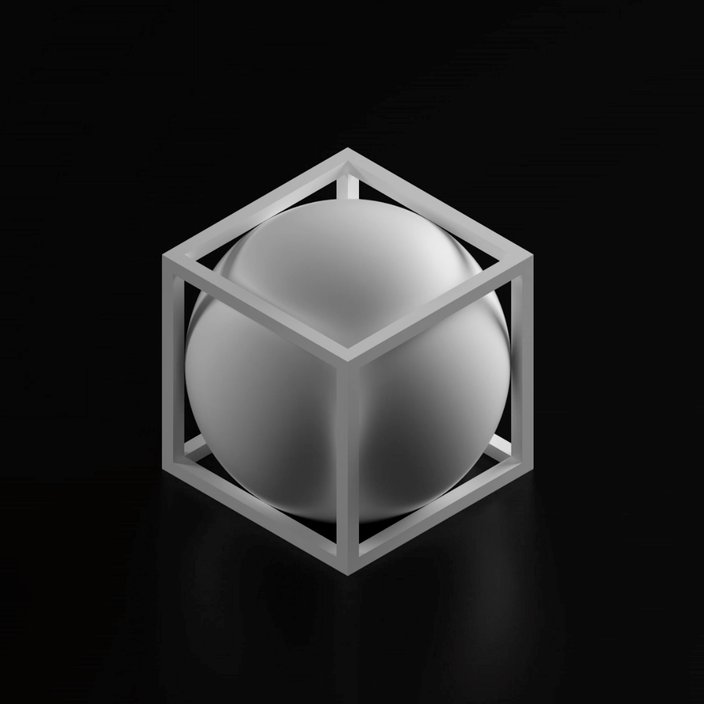
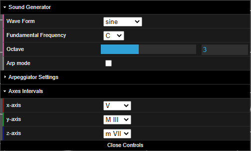
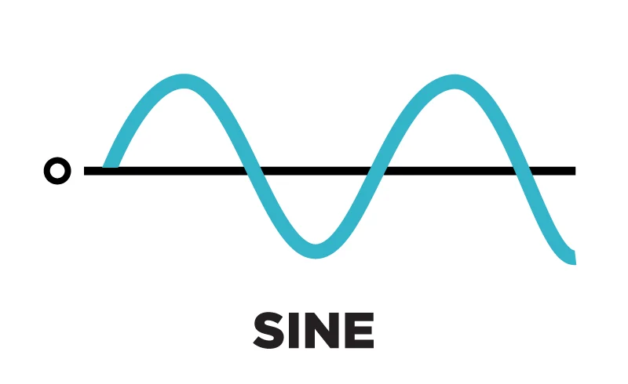
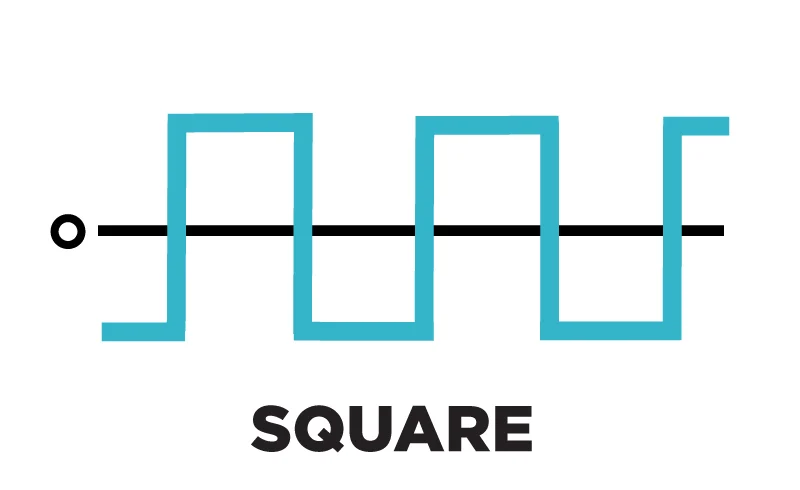
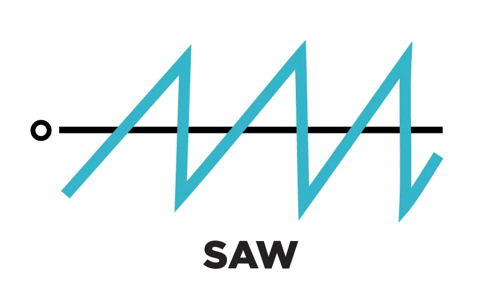
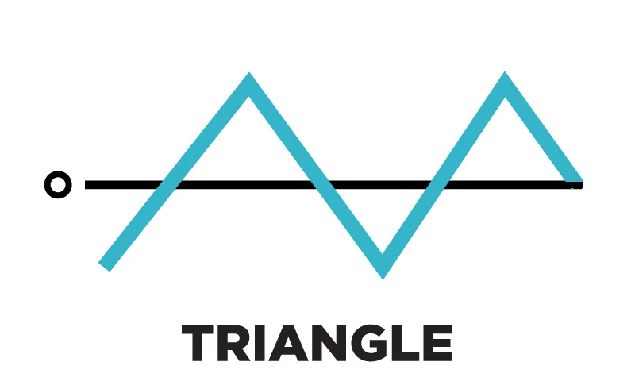
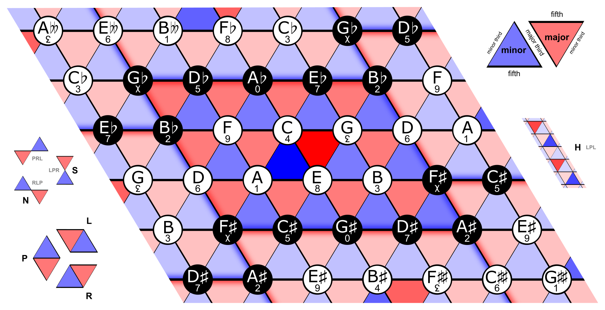
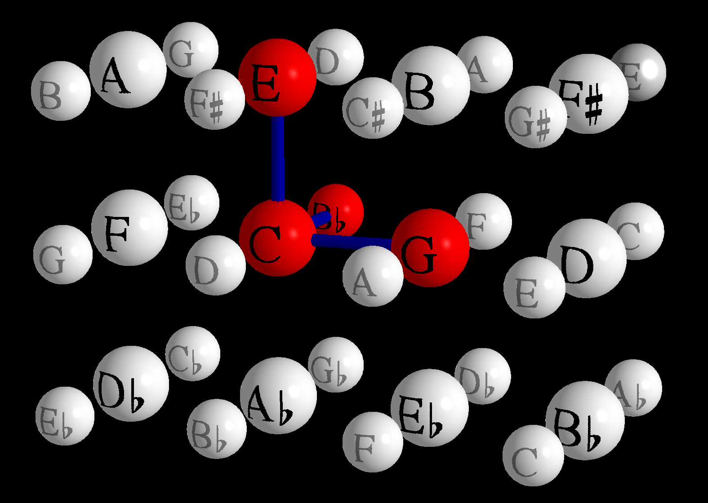

# **VR-mony**
### A platonic solid love experience.
 

 

- [Introduction](#introduction)
- [Navigating in VR-mony](#navigating-in-vr-mony)
    - [The Book](#the-book)
    - [The Room](#the-room)
        - [The Spheres](#the-spheres)
        - [Reference System](#reference-system)
        - [Controls](#controls)
        - [User Interface](#user-interface)
        - [Multi-user Interaction](#multi-user-interaction)
- [Music Theory](#music-theory)
    - [The Tonnetz](#the-tonnetz)
    - [Vogel's Tonnetz](#vogels-tonnetz)
    - [Implementation](#implementation)
        - [Audio](#audio)
        - [3D](#3d)
        - [VR](#vr)
- [Demo Video](#demo-video)
- [Useful Links](#useful-links)
- [Group Members](#group-members)

# **Introduction**
This project has been developed for the course "**Advanced Coding Tools and Methodologies**" of the MSc in *Music and Acoustic Engineering* of the *Politecnico di Milano*.
 
***VR-mony*** is a minimal abstract space in which the user can interact with spherical synthetic sound sources.
 
It is a **3D web-based application** with **positional audio** accessible both from VR headsets and from PCs.
  

# **Navigating in VR-mony**
The app can be run either by downloading the whole repository and running it with a live server or by clicking on the following link.

<a href="https://fradelgs.github.io/VRmony">**Open VR-mony**</a>
 
Remember to switch on the audio of your device and to wear your headphones.
 
The best way to appreciate the audio-video spaciality of VR-mony is to access the link from the browser of a 6DoF VR headset.
  

## **The Book**
The homepage is just a joke.
If the user knows where to touch, the app will ask him/her/them to play.

There are just two rules:
- No means no.
- Two is love, three is a chord.

 

  

## **The Room**
The user is suddenly teleported into a minimalistic tridimensional room with just a bunch of organized spheres, three lines and a user interface.

 

  

### **Controls**
**PC** users can move into the space, activate sounds and modify them with a mouse:

PAN/TILT : Hold the left mouse button to rotate in 3D.
 
DOLLY : Hold the mouse wheel to move back and forth.
 
MOVE : Hold the right mouse button to move horizontally and vertically.
 
PLAY : Left click on a sphere to activate or deactivate its sound.
  

**VR** users will be able to see a green button on the bottom right of the screen if their device is VR-ready and clicking it they can access the VR experience and get out of it.

| Enter VR | Exit VR |
|:--------:|:-------:|
|  |  |

- A 3 DoF device (e.g. smartphones inside a Google Cardboard) can only track rotational movement. This is common in devices which rely exclusively on accelerometer and gyroscope readings to provide tracking. Therefore, the user can rotate the camera around the 3 axes and click by means of a bluetooth controller.

- A 6 DoF headsets (Oculus Quest, HTC Vive) can track both rotation and translation, enabling precise 1:1 tracking. Therefore, the user can move in the virtual space and use controllers to interact with objects.
 
☰ Use the hamburger button on the left controller to exit.
  

### **The Spheres**
A cube of 3x3x3 spheres is the core of ***VR-mony***.

The glowing sphere at the center of the cube plays the fundamental note while the spheres around it have different notes depending on the direction they are located with respect to the fundamental one.

Default settings generate a cube with a $C_3$ on the fundamental sphere and then develop the other spheres with the following intervals:
- x axis: Fifth
- y axis: Major Third
- z axis: minor Seventh
  

### **Reference System**
Three lines with different colours constitute a reference system with the origin in the center of the fundamental note sphere.
 Each line is thicker on the side where the interval goes toward higher frequencies and it is thinner going towards lower frequencies.
 Line colours match the colours in the GUI<!-- and the setted intervals are reported on the thicker end of each line-->.
  

### **User Interface**
A simple user interface allows the user to control the sound generator and the interval on each axis.

 

- **WAVE FORM:** allows to set the wave form of the generated sounds
    

    
    | sine | square | sawtooth | triangle |
    | ---- |:------:|:--------:| --------:|
    

    

    
    
    

    

    
    
    

 

- **FUNDAMENTAL FREQUENCY:** allows to set the note of the central sphere

| C   | C#  | D   | D#  | E   | E#  | F   | F#  | G   | G#  | A   | A#  | B   |
| --- |:---:|:---:|:---:|:---:|:---:|:---:|:---:|:---:|:---:|:---:|:---:| ---:|

 

- **OCTAVE:** allows to set the octave of the fundamental frequency from 1 to 6 where $C_3$ is the middle $C$ with $f=262 Hz$.
  

- **X-AXIS / Y-AXIS / Z-AXIS:** allow to set the development interval on each axis.

| min II | Maj II | min III | Maj III | IV | min V | V | min VI | Maj VI | min VII | Maj VII | VIII |
| ------ |:------:|:-------:|:-------:|:--:|:-----:|:-:|:------:|:------:|:-------:|:-------:| ----:|

  

### **Multi-user Interaction**
Thanks to an external database on [Firebase](https://firebase.google.com/) it is possible for 2 or more users to access VR-mony at the same time and see and hear changes made by other players in real-time.
  

# **Music Theory**
An _interval_ is a difference in pitch between two sounds. It may be described as _horizontal_ (or _melodic_) if it refers to successively sounding tones, such as two adjacent pitches in a melody, and _vertical_ (or _harmonic_) if it pertains to simultaneously sounding tones, such as in a chord.

In Western music, intervals are most commonly differences between notes of a diatonic scale and the most common naming scheme for intervals describes two properties of the interval: the quality (perfect, major, minor, augmented, diminished) and number (unison, second, third, etc.).

The size of an interval between two notes may be measured by the ratio of their frequencies. When a musical instrument is tuned using a _just intonation tuning system_, the size of the main intervals can be expressed by small-integer ratios, such as $1:1$ (unison), $2:1$ (octave), $5:3$ (major sixth), $3:2$ (perfect fifth), $4:3$ (perfect fourth), $5:4$ (major third), $6:5$ (minor third). Intervals with small-integer ratios are often called just intervals, or pure intervals.

Most commonly, however, musical instruments are nowadays tuned using a different tuning system, called _**12-tone equal temperament**_. As a consequence, the size of most equal-tempered intervals cannot be expressed by small-integer ratios, although it is very close to the size of the corresponding just intervals. For instance, an equal-tempered fifth has a frequency ratio of $2^{7/12}:1$, approximately equal to $1.498:1$, or $2.997:2$ (very close to $3:2$).
  

## **The Tonnetz**
In musical tuning and harmony, the _**Tonnetz**_ (German for '_tone network_') is a conceptual lattice diagram representing tonal space first described by _Leonhard Euler_ in 1739. This bidimensional representation is useful to illustrate and analyze chords and their relationships.
Various visual representations of the Tonnetz can be used to show traditional harmonic relationships in European classical music.

<figure>

 

<figcaption align="center"><i>A modern rendering of the Tonnetz. The A minor triad is in dark blue, the C major triad in dark red.</i>
</figure>
  

## **Vogel's Tonnetz**
_**Vogel's Tonnetz**_ is a graphical and mathematical representation of the scale range of _just intonation_, introduced by German music theorist _Martin Vogel_ 1976 in his book _Die Lehre von den Tonbeziehungen_ (English: _On the Relations of Tone_, 1993). The graphical representation is based on _Euler's Tonnetz_, adding a **third dimension** for just sevenths to the two dimensions for just fifths and just thirds.
The four-dimensional mathematical representation including **octaves** allows the evaluation of the congruency of harmonics of chords depending on the tonal material. It can thus also serve to determine the optimal tonal material for a certain chord.

<figure>

 

<figcaption align="center"><i>Representation of the C Major Seventh quadriad in Vogel's Tonnetz.</i>
</figure>
  

# **Implementation**
**VR-mony** is developed with _HTML_, _CSS_ and _Javascript_ languages taking advantage of the following libraries and Application Programming Interfaces (API).

- [Web Audio API](https://www.w3.org/TR/webaudio/) is a high-level Web API for processing and synthesizing audio in web applications.

- [THREE.js](https://threejs.org/) is a cross-browser JavaScript library and API used to create and display animated 3D computer graphics in a web browser using _WebGL_.

- [WebXR API](https://www.w3.org/TR/webxr/) provides access to input (pose information from headset and controllers) and output (hardware display) capabilities commonly associated with Virtual Reality (VR) and Augmented Reality (AR) devices. It allows you develop and host VR and AR experiences on the web.
  

# **Demo Video**

  

# Useful Links
- [THREE.js](https://threejs.org/)
- [WebXR API](https://www.w3.org/TR/webxr/)
- [Web Audio API](https://www.w3.org/TR/webaudio/)
- [Firebase](https://firebase.google.com/)
- [FontAwesome](https://fontawesome.com/)

- [Interval](https://en.wikipedia.org/wiki/Interval_(music))
- [Euler's Tonnetz](https://en.wikipedia.org/wiki/Tonnetz)
- [Vogel's Tonnetz](https://en.wikipedia.org/wiki/Vogel%27s_Tonnetz)
  

# *Group members*
- Francesca Del Gaudio (francesca.delgaudio@mail.polimi.it)
- Valerio Maiolo (valerio.maiolo@mail.polimi.it) 